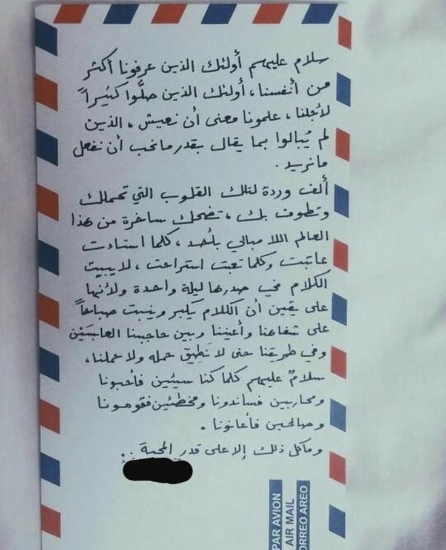
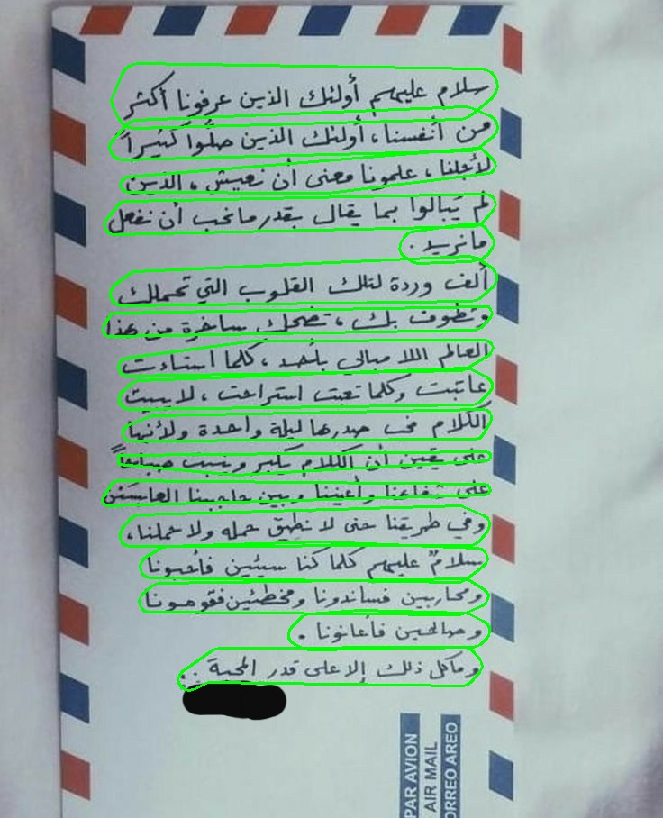
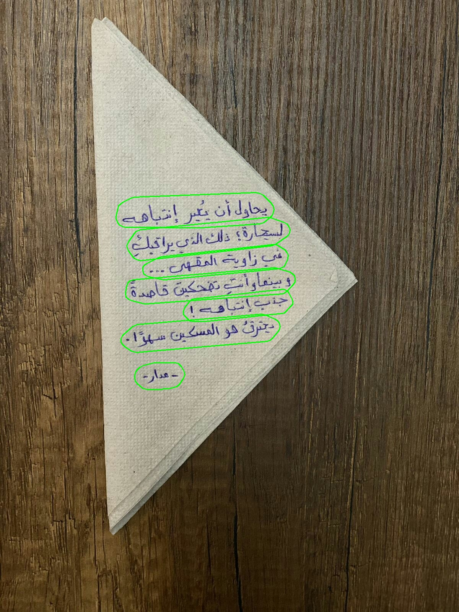
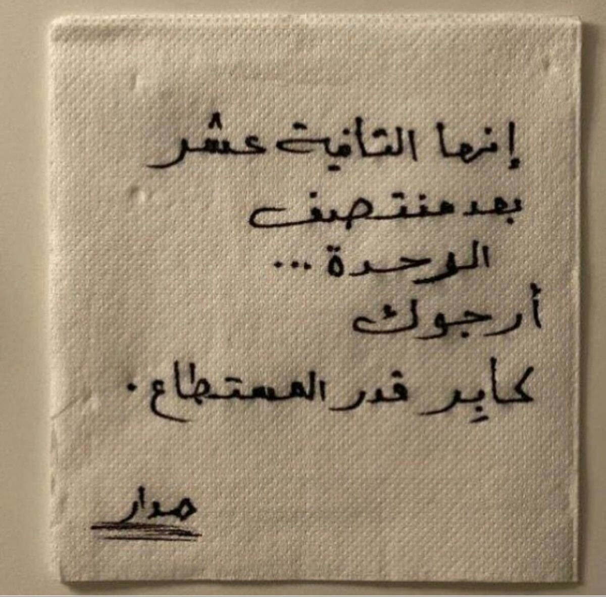
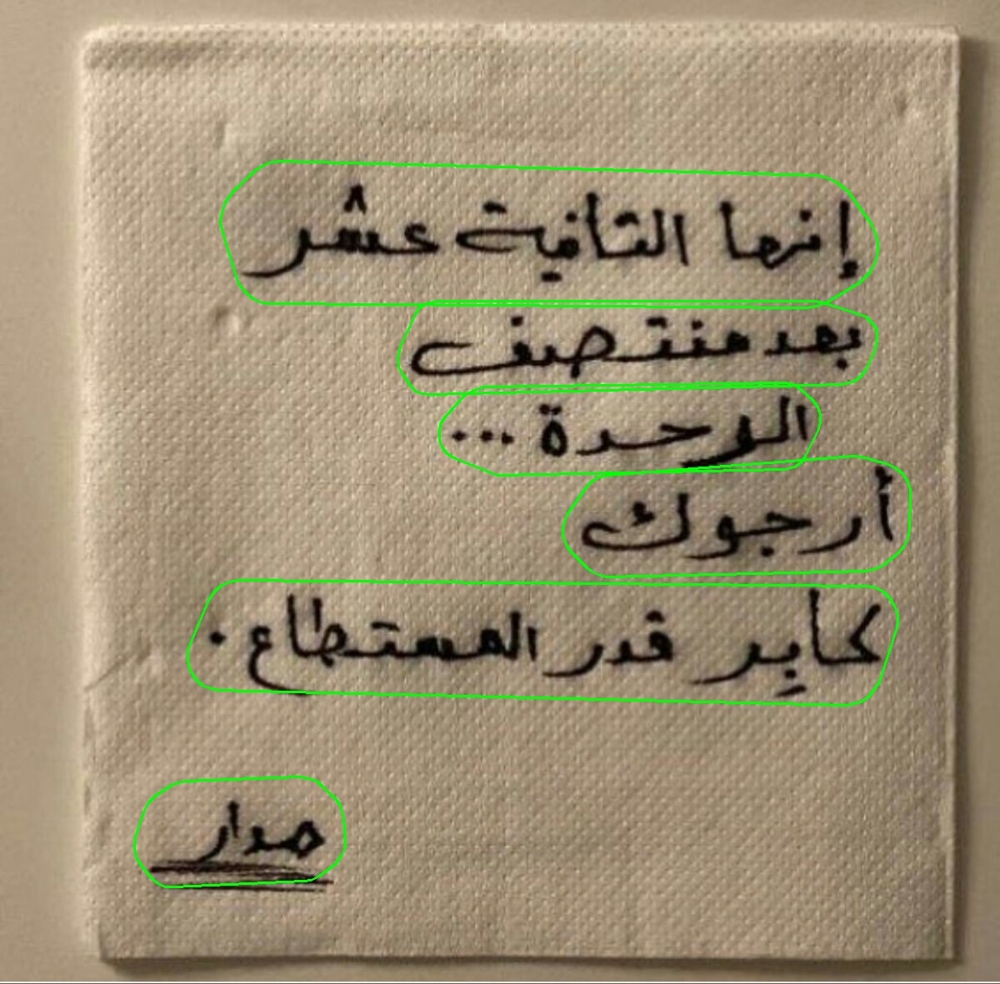

# Arabic Handwritten Document Data-Listing Solution


## How To Install
```bash
conda create -n ahdoc python=3.10
conda activate ahdoc

conda install ipython pip

# python dependencies
pip install -r requirement.txt

# clone repo
git clone https://github.com/Hedrax/AHDoc.git
cd AHDoc/

```

## Data
### Text-Detection
* [Arabic Documents OCR Dataset](https://www.kaggle.com/datasets/humansintheloop/arabic-documents-ocr-dataset)
#### Evaluation
* [Custom Data](https://drive.google.com/file/d/1J-T1G0f_v7B-77SYkw-Fm5qsc8lfUgnT/view?usp=sharing)
## Model Best-Weights
* [Text Detecion](https://drive.google.com/file/d/189kiCJ6oYeW5IqtLdvW4RV90AuVgFXwN/view?usp=sharing)
* [OCR - Model](https://github.com/Hedrax/AHDoc/tree/main#)
  
## Data Preparation
### Text-Detection
* Datasets must follow the format of the custom Data format provided above
* ```utils.py``` has all functions needed to migrate from JSON with Pascal and txt with Yolo format
* ```utils.py``` also has all functions needed to list images names and get corresponding label files to list in .txt file
## Train
### Text-Detection
* Follow instructions in ```train.py```
* All training configurations are saved in ```config.py```
## Test
### Text-Detection
* put the weights files downloaded from the above reference to ```./Text Detection/weights/```
* Follow instructions in ```inference.py```
* All test configurations are saved in ```config.py```

## Results
### Text-Detection
We compare best-weights of universal model performance on our custom evaluation Arabic handwritten data
<table tabindex="0">
<thead>
<tr>
<th align="center">Weights</th>
<th align="center">Precision (%)</th>
<th align="center">Recall (%)</th>
<th align="center">F-measure (%)</th>
</tr>
</thead>
<tbody>
<tr>
<td align="center"><a href="https://drive.google.com/file/d/1e0K1AAYECL_-ZpbVqFa65msBZoDhP0sl/view" rel="nofollow">Universal Model</a></td>
<td align="center">61.53</td>
<td align="center">34.60</td>
<td align="center">41.33</td>
</tr>
<tr>
<td align="center"><a href="https://drive.google.com/file/d/189kiCJ6oYeW5IqtLdvW4RV90AuVgFXwN/view?usp=sharing" rel="nofollow">Our-Model</a></td>
<td align="center">81.66</td>
<td align="center">78.82</td>
<td align="center">79.07</td>
</tr>
</tbody>
</table>

## Demo
### Text-Detection
<p align="center">
  
  
</p>

<p align="center">
  
  
</p>


<p align="center">
  
  
</p>


### reference
1. https://arxiv.org/abs/1911.08947
2. https://github.com/zonasw/DBNet
3. https://github.com/MhLiao/DB
