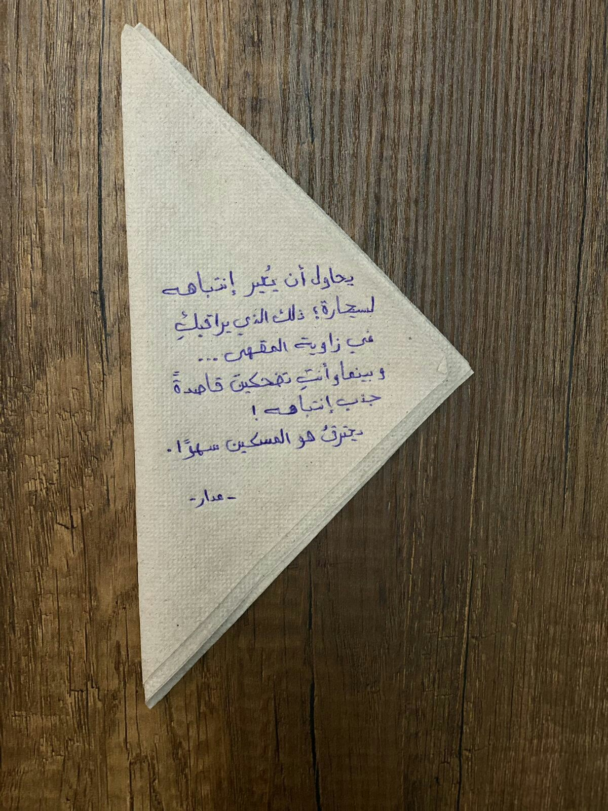

# Arabic Handwritten Document Data-Listing Solution


## How To Install
```bash
conda create -n ahdoc python=3.10
conda activate ahdoc

conda install ipython pip

# python dependencies
pip install -r requirement.txt

# clone repo
git clone https://github.com/Hedrax/AHDoc.git
cd AHDoc/

```
## How to use our pre-trained text detection model in ONNX format
### Download the .onnx best weights
* [Text Detection Model.onnx](https://drive.google.com/file/d/1ys_jcWokjk4aPqGB75dj3FRnj5IH3W2l/view?usp=sharing)  
**Note: you will need Inference.py code to be able to turn the predictions into bounding boxes**
  
## Data
### Text-Detection
* [Arabic Documents OCR Dataset](https://www.kaggle.com/datasets/humansintheloop/arabic-documents-ocr-dataset)
#### Evaluation
* [Custom Data](https://drive.google.com/file/d/1J-T1G0f_v7B-77SYkw-Fm5qsc8lfUgnT/view?usp=sharing)
### OCR ENGINE
* [Raw Data](https://drive.google.com/drive/folders/1mRefmN4Yzy60Uh7z3B6cllyyOXaxQrgg)
## Model Best-Weights
* [Text Detecion](https://drive.google.com/file/d/189kiCJ6oYeW5IqtLdvW4RV90AuVgFXwN/view?usp=sharing)
* [OCR - Model](https://drive.google.com/file/d/1Hebi3EvILLgr-g9SzfawZBropl-zGYzG/view?usp=sharing)
  
## Data Preparation
### Text-Detection
* Datasets must follow the format of the custom Data format provided above
* ```utils.py``` has all functions needed to migrate from JSON with Pascal and txt with Yolo format
* ```utils.py``` also has all functions needed to list image names and get corresponding label files to list in .txt file
### OCR Engine

* Datasets must follow the format all images in png in the same directory with ```labels.txt``` labels must be in the form ```imageNameWithoutExtension_groundTruth```
* ```utils.py``` has all functions needed for dataset preparation
## Train
* Follow instructions in ```train.py```
* All training configurations are saved in ```config.py```
## Test
* put the weights files downloaded from the above reference to ```./Text Detection/weights/``` and ```./OCR Engine/weights/```
* Follow instructions in ```inference.py``` and ```evaluation.py``` in terms of OCR Engine
* All test configurations are saved in ```config.py```

## Results
### Text-Detection
We compare best-weights of universal model performance on our custom evaluation Arabic handwritten data
<table tabindex="0">
<thead>
<tr>
<th align="center">Weights</th>
<th align="center">Precision (%)</th>
<th align="center">Recall (%)</th>
<th align="center">F-measure (%)</th>
</tr>
</thead>
<tbody>
<tr>
<td align="center"><a href="https://drive.google.com/file/d/1e0K1AAYECL_-ZpbVqFa65msBZoDhP0sl/view" rel="nofollow">Universal Model</a></td>
<td align="center">61.53</td>
<td align="center">34.60</td>
<td align="center">41.33</td>
</tr>
<tr>
<td align="center"><a href="https://drive.google.com/file/d/189kiCJ6oYeW5IqtLdvW4RV90AuVgFXwN/view?usp=sharing" rel="nofollow">Our-Model</a></td>
<td align="center">81.66</td>
<td align="center">78.82</td>
<td align="center">79.07</td>
</tr>
</tbody>
</table>


### OCR Module Performance Results
Our results on the TEST set of 18-fonts
| \# | Number of Words | Solid Accuracy% |   | Salted Accuracy% |   | Bolded Accuracy% |   | Notes |
|:-:|:-:|:-:|:-:|:-:|:-:|:-:|:-:|:-:|
|   |   | CRR | WRR | CRR | WRR | CRR | WRR |   |
| 1 | 1 | 94.28 | 70.05 | 91.85 | 57.08 | 77.25 | 17.81 | Tested on 7-Character Words |
| 2 | 1 | 94.24 | 54.06 | 91.42 | 50.94 | 90.19 | 46.04 | - |
| 3 | 2 | 89.81 | 39.38 | 87.11 | 34.84 | 86.75 | 33.85 | - |
| 4 | 3 | 89.64 | 35.63 | 88.23 | 37.39 | 87.79 | 35.59 | - |
| 5 | 4 | 82.23 | 28.59 | 80.41 | 24.61 | 80.25 | 24.61 | - |
| 6 | 5 | 73.17 | 20.25 | 71.88 | 17.225 | 70.25 | 16.62 | - |
| 7 | 6 | 66.01 | 18.78 | 64.95 | 13.48 | 63.50 | 14.39 | - |

## Demo
### Text-Detection
<p align="center">
  
  
</p>

<p align="center">
  
  
</p>


<p align="center">
  
  
</p>

### OCR-ENGINE

<p align="center">
  
</p>

### reference
1. https://arxiv.org/abs/1911.08947
2. https://github.com/zonasw/DBNet
3. https://github.com/MhLiao/DB

## Citation
### If you used our work in your research feel free to cite us
```
@inproceedings{waly2024arabic,
  title={Arabic Handwritten Document OCR Solution with Binarization and Adaptive Scale Fusion Detection},
  author={Waly, Alhossien and Tarek, Bassant and Feteha, Ali and Yehia, Rewan and Amr, Gasser and Fares, Ahmed},
  booktitle={2024 6th Novel Intelligent and Leading Emerging Sciences Conference (NILES)},
  pages={316--319},
  year={2024},
  organization={IEEE}
}
```
